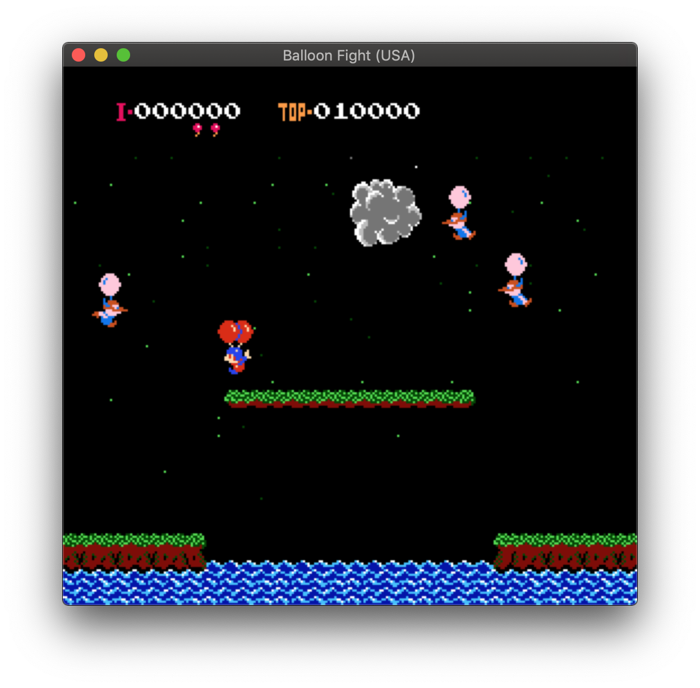

<div align="center">
  
  <h1>NESEmulator</h1>
  <br>
  <br>
  <br>
</div>

Modular and extensible Nintendo Entertainment System emulator written in C (still under development).

Always wanted to write some console emulator, so here it is.

## What Works

- 6502 cpu emulation - cycle exact, both documented and undocumented opcodes, without decimal mode
- PPU emulation - still requires some work (graphical artefacts occur), but most popular titles using supported mappers should work just fine
- iNES memory mappers: 0, 2, 3
- Cocoa frontend featuring game library and keyboard controls
- Utility tools written in Elixir:  
  - NES ROM disassembler: [nes-dasm.exs](./Disassembler/nes-dasm.exs)
  - NES ROM examiner: [rom-info.exs](./Disassembler/rom-info.exs)
  - PRG ROM extractor: [extract-prg.exs](./Disassembler/extract-prg.exs)

## Screenshots

<div align="center">
  
  
  
  
</div>

## Controls

You can create your own keyboard keymap in settings, located at `nescocoa` -> `Preferences...`. Default keymap for controller 1 is below.

| NES                   | nescocoa   |
| -                     | -          |
| Up, Down, Left, Right | Arrow keys |
| START                 | w          |
| SELECT                | q          |
| A                     | a          |
| B                     | s          |

## Architecture

Project is using client-server architecture, with OS-specific frontend being a client and emulation library acting as a server.

<div align="center">

</div>

## Requirements

* CMake 3.7+
* clang/clang++
* Google Test 1.8.1+
* opencv 4 (for some tools)
* macOS 10.14+ (for Cocoa frontend)

## How to build

Just emulation library:
```
> mkdir Build/
> cd Build/
> cmake ../Emulator
> make
```

Emulation library and Cocoa frontend (only for macOS):
```
> cd Drivers/Cocoa
> ./build.sh
```
Then open `nescocoa.xcodeproj`, build and run.
